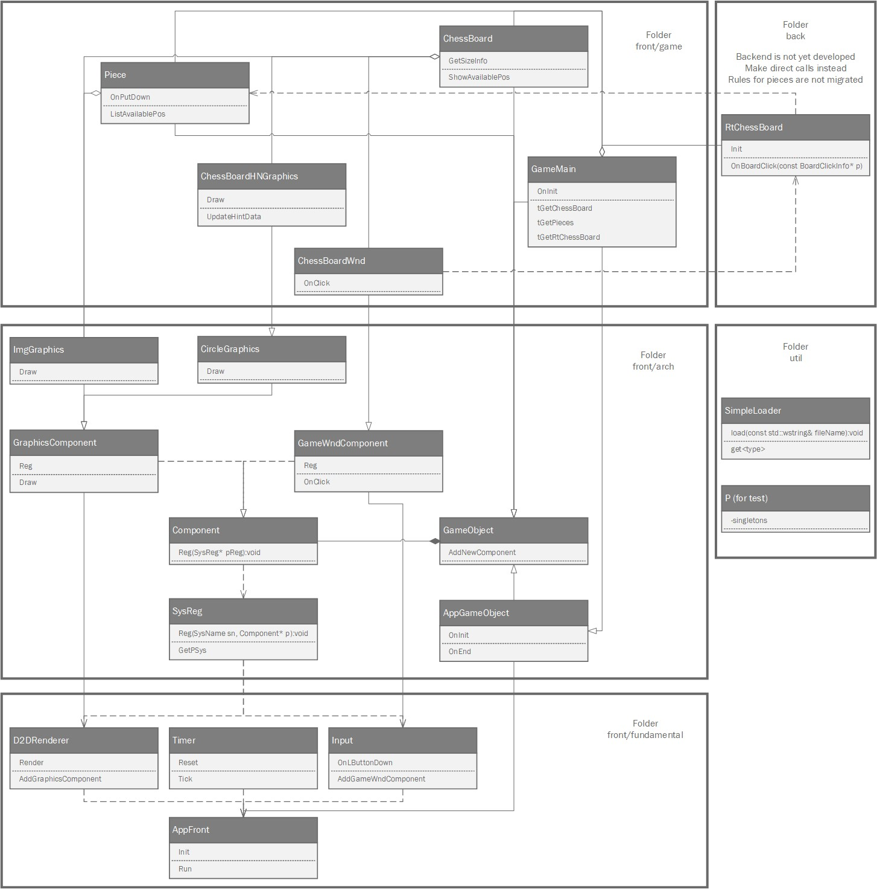

# DemoChess 简介

该项目目前实现了部分象棋对弈功能。

制作该项目的主要目的是学习C++并练习写代码，顺便以象棋和游戏作为练习对象。因此，可能存在些超过实际需求的设计。

游戏方面，参考了Gilles Bellot的教程，且Timer类取自其教程项目。调用Direct 2D进行渲染。

## 已实现
+ 读取配置和图像文件
+ 绘制棋子棋盘
+ 按规则行棋和提子

## 待实现
+ 构建后端，并将规则迁移至后端
+ 双人对弈
+ 与电脑对弈

# 使用

1. 下载整个项目
2. 使用Visual Studio打开sln文件，然后编译运行

# 类的功能和关系概览

